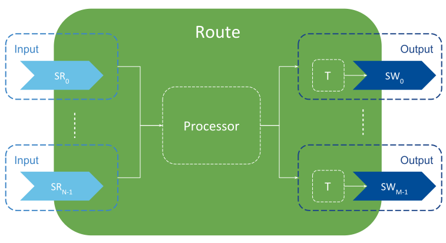
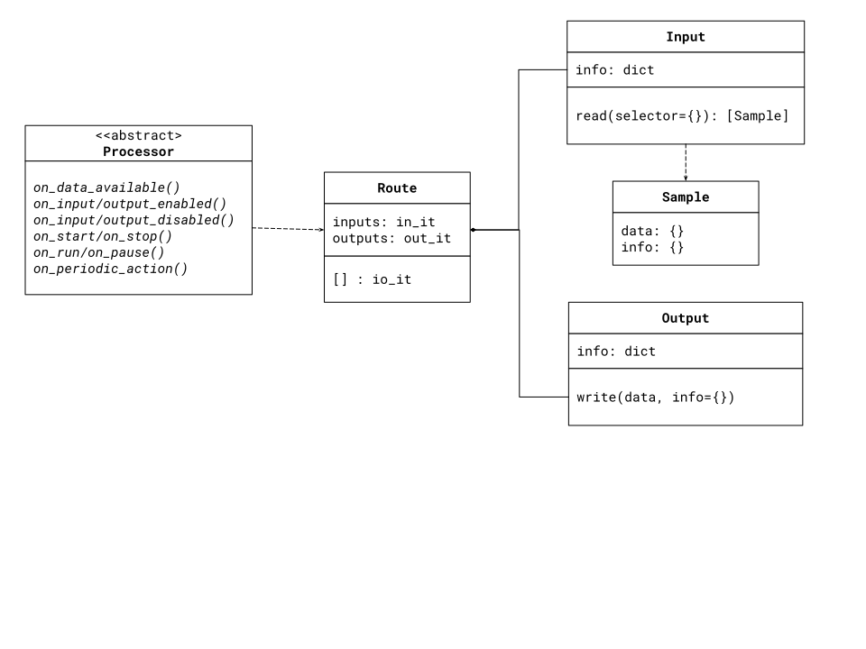

********************
Processor Python API
********************

A plug-in implementation of the Processor C/C++ API that provides a binding for
the Python language.

Concept
=======

*Routing Service Processor* is a pluggable-component that allows controlling the
forwarding process that occurs within *Routes*. The *Routing Service Software
Development Kit* offers a set of APIs that you can implement to customize
the *Route* behavior. See [Chapter SDK in Routing Service User's Manual]
(https://community.rti.com/static/documentation/connext-dds/6.0.0/images/manuals/routing_service/sdk.html)
for a list of officially supported languages.

This plug-in provides an implementation of a *Processor* (to provide an user-level
Python binding. The plug-in relies on the native interface of Python (known
as `ctype`).

The general model of a *Processor* is shown in figure below.

A *Processor* represents a multiple-input, multiple-output component attached
to a *Route*, which dispatches events to the *Processor*. A *Processor* can
access the N inputs and M outputs of the owner *Route*. Upon event
notification, the *Processor* can read data from any input, perform any
manipulation on the data, and write it on any of the outputs.

An example snippet is shown below. The example code is reading data from two
inputs, merging the data together to write a single output sample.

.. code-block::

    def on_data_available(self, route):
        samples_first = route.inputs[0].read()
        for first in samples:
            # read from the second input, the same instance of the sample to merge
            samples_second = route.inputs[1].read(dict(instance=first.info['instance_handle']))

            output_data = {
                id:first.data['id'],
                config:first.data['config'],
                periodic:samples_second[0].data['latency']
            }

            route.outputs[0].write(output_data)

API Overview
============

The Processor Python API component model is shown below.

The Python API model is based of two different of components:

- Classes: These are representations of *Routing Service* entities that provide
  behavior usable by *Processor* implementations. There are five classes:

    - ``Processor``: The plug-in implementation. This is an abstract class from which
      implementations inherit from to customize the behavior of *Routes*. Note that
      all the callbacks are optional, so you can implement those you need.
    - ``Route``: This class represent instances of the *Routes*, which provide access
      to the inputs and outputs within.
    - ``Input``: Representation of a *Route* input from which you can read data.
    - ``Output``: Representation of a *Route* output to which you can write data.
    - ``Sample``: Representation of the information returned by a read operation
      on an input.

- Dictionaries: These are representation of pure data structures, containing
  as member names as keys and member values as values:

   - ``Input`` and ``Output`` description properties (name, stream and type names, etc).
   - ``Sample``'s data and information elements
   - ``Selector`` objects used to read subsets of data from the `Input`

A ``Processor`` implementation can perform operations on any of the other
components as needed. The user provides an implementation of a ``Processor``
whereas the other objects are constructed and provided by *Routing Service* during
the execution of the ``Processor``

API Reference
-------------

.. class:: Processor

    Processor interface definition. Provides a way to process Route events and
    control the data forwarding process.

    A Processor receives event notifications from its Route owner in the form
    of operation callbacks. Each event occurrence will be dispatched to the
    Processor by calling the corresponding method.

    Each dispatching method has a signature according to the event kind and
    data it is associated with. Each event is associated with a Route state;
    hence limitations and constraints may apply individually to each method.

    Note that throwing an exception while processing any of the event
    notifications is allowed. In this situation, the Route owner will reject
    the events and none of the associated post conditions will be applied,
    including state transitions.

    Multi-threading safety:
    Partially Safe All operations on a concrete Processor object are safe and
    always serialized on a given Session. Operations on different Processor
    objects may be called concurrently if they belong to different Routes.

    .. method:: on_input_enabled(route, input)
        :abstractmethod:

        Notification of the INPUT_ENABLED event.

        This operation is called when an Input enabled event occurs that affects
        any of the inputs contained in the owner Route.

        This operation is called right after the affected Input has been enabled.

        :param Route route: owner that contains this Processor
        :param input:  The just enabled Input

    .. method:: on_input_disabled(route, input)
        :abstractmethod:

        Notification of the INPUT_DISABLED event.

        This operation is called when an INPUT_DISABLED event occurs that
        affects any of the inputs contained in the owner Route.

        This operation is called right before the affected Input is disabled.

        :param Route route: owner that contains this Processor
        :type route: Route
        :param input:  The Input about to be disabled.

    .. method:: on_output_enabled(route, output)
        :abstractmethod:

        Notification of the OUTPUT_ENABLED event.

        This operation is called when an Output enabled event occurs that affects
        any of the outputs contained in the owner Route.

        This operation is called right after the affected Output has been enabled.

        :param route: owner that contains this Processor
        :type route: Route
        :param output:  The just enabled Output.

    .. method:: on_output_disabled(route, output)
        :abstractmethod:

        Notification of the OUTPUT_DISABLED event.

        This operation is called when an OUTPUT_DISABLED event occurs that
        affects any of the outputs contained in the owner Route.

        This operation is called right before the affected Output is disabled.

        :param route: owner that contains this Processor
        :type route: Route
        :param output:  The Output about to be disabled.

    .. method:: on_start(route)
        :abstractmethod:

        Notification of the Route started event.

        This operation is called right before the Route enters the STARTED
        state. At the time this operation is called, all the inputs and
        outputs within the Route are enabled.

        :param route: owner that contains this Processor
        :type route: Route

    .. method:: on_stop(route)
        :abstractmethod:

        Notification of the Route stopped event.

        This operation is called right before the Route enters the STOPPED
        state. At the time this operation is called, all the inputs and
        outputs within the Route are still enabled.

        :param route: owner that contains this Processor
        :type route: Route

    .. method:: on_run(route)
        :abstractmethod:

        Notification of the Route RUN event.

        This operation is called right before the Route enters the RUNNING
        state. This operation is called after the Route went to STARTED after
        a successful notification to this Processor,

        If the Route was manually paused before via an Administration call,
        this operation will not be called until a manual run operation is performed.

        :param route: owner that contains this Processor
        :type route: Route

    .. method:: on_pause(route)
        :abstractmethod:

        Notification of the Route paused event.

        This operation is called right before the Route enters the PAUSED
        state. At the time this operation is called, all the inputs and
        outputs within the Route are still enabled.

        :param route: owner that contains this Processor
        :type route: Route

    .. method:: on_periodic_action(route)
        :abstractmethod:

        Notification of the Route periodic action event.

        This operation is called periodically at the rate specified in the
        parent Session of the Route owner.

        Periodic notifications can occur only while the Route is in the
        RUNNING state.

        Implementations are allowed to access any of the Input and Output of
        the owner Route to read and write data, respectively.

        :param route: owner that contains this Processor
        :type route: Route

    .. method:: on_data_available(route)
        :abstractmethod:

        Notification of the Route DATA_AVAILABLE event.

        This operation is called each time any of the inputs contained in
        the owner Route is notified about new data. Notifications of this
        event can occur only while the Route is in the RUNNING state.

        Implementations are allowed to access any of the Input and Output of
        the owner Route to read and write data, respectively.

        :param route: owner that contains this Processor
        :type route: Route

.. class:: Route

    .. attribute:: inputs

        An iterator to the enabled Input objects within this Route. Note that
        this iterator can be used only when the Route is started. Otherwise,
        the iterator will be finished.

        Immutable.

    .. attribute:: outputs

        An iterator to the enabled Outputs objects within this Route. Note that
        this iterator can be used only when the Route is started. Otherwise,
        the iterator will be finished.

        Immutable.

    .. method:: operator.getitem(name) -> Input or Output

        Looks up an input or an output by its name (as specified in the
        configuration)

        :param str name: The name of the input or output

        :returns: The specified Input or Output object
        :rtype: An Input or Output object, or None if the input our output does
                not exist or it's not enabled.

.. class:: Input

    Generic Representation of a Route's input

    .. attribute:: info

        Returns a dictionary containing information that uniquely describes this
        Input. The dictionary contains the following key items:

        .. code-block:: Python

            {
                "index" : <int>,
                "name": <str>,
                "stream_info" : {
                    "stream_name" : <str>,
                    "type_name":  <str>
                }
            }

        where
            - ``index``: The access index of this Input
            - ``name`` : The name of this Input, as specified in the XML
              configuration
            - ``stream_info``:
                - ``stream_name``: Name of the stream this input reads
                   data from
                - ``type_name``: Registered name of the type associated to the
                  stream and data

        Immutable.

    .. method:: take([selector]) -> list[Sample]

        Returns all the available samples in this Input.

        This operation will call the take operation on the underlying StreamReader.
        Note that this operation will remove all the taken samples from the
        StreamReader's cache.

        An optional selector as a dictionary can be provided in order to read
        subset of data (e.g., a particular instance). The selector can
        contain the following key items:

         .. code-block:: Python

            {
                "sample_state" : <int>,
                "view_state" : <int>,
                "instance_state" : <int>,
                "max_samples" : <int>,
                "instance" : {<bool>, <Bytes>},
                "next_instance" :{<bool>, <Bytes>},
                "filter" : {
                    "expression" : <str>
                }
            }

         where
            - ``sample_state``: The sample read state as DDS_SampleStateKind
            - ``view_state`` : the instance view state as DDS_ViewStateKind
            - ``instance_state`` : the instance view state as DDS_InstanteStateKind
            - ``max_samples`` : Choose to only read/take up to a maximum number of samples.
            - ``instance`` :
                - ``valid:``: Indicates whether the handle is valid or not
                - ``value``: A 16-byte list representing a handle to the instance
                  to read/take. Setting this field causes the read/take to access
                  only samples belonging the single
                  specified instance handle. The read/take may
                  operation may fail if the handle does not
                  correspond to an existing data-object known to this Input.
            - ``next_instance``:
                - ``valid``: Indicates whether the handle is valid or not
                - `value``: A 16-byte list representing a handle to the
                  instance from which to read next. The subsequent read or take
                  operation to access only samples belonging a single instance
                  whose handle is considered 'next' after the provided handle.
                  The accessed samples will all belong to the 'next' instance with
                  handle 'greater' than the specified previous handle that has
                  available samples. An invalid handle can be provided as
                  "less than" any valid handle so the read/take will return the
                  samples for the instance that has the smallest handle among a
                  all the instances that contain available samples.

                  Note that it is possible to provide a handle that does not c
                  correspond to an instance currently managed by the underlying
                  StreamReader.
            - ``filter``: A dictionary that represents a content filter
                - ``expression``: An expression selection a subset of data based
                  on its content.

        :param dict selector: A dictionary that represents a selector of a
                              a subset of the data to be read.

        :returns: A list of read samples.
        :rtype: List of Sample

.. class:: Output

    Generic Representation of a Route's output

    .. attribute:: info

        Returns a dictionary containing information that uniquely describes this
        Output. The dictionary contains the following key items:

        .. code-block:: Python

            {
                "index" : <int>,
                "name": <str>,
                "stream_info" : {
                    "stream_name" : <str>,
                    "type_name":  <str>
                }
            }

        where
            - ``index``: The access index of this Output
            - ``name`` : The name of this Output, as specified in the XML
              configuration
            - ``stream_info``:
                - ``stream_name``: Name of the stream this output writes
                   data to
                - ``type_name``: Registered name of the type associated to the
                  stream and data

        Immutable.

    .. method:: write(data[,info])

        Writes the specified data and info sample in this output.

        This operation will call the write operation on the underlying StreamWriter.

        :param dict data: A dictionary that represents the sample data, in the
         same format as in Sample.data

        :param dict info: A dictionary that represents the sample info, in the
         same format as in Sample.info

.. class:: Sample

    Representation of sample objects returned by a read/take operation.
    It's composed of two items, the sample data and sample info (metadata).

    .. attribute:: data

        User-data portion of the sample. Represented as dictionary where the key
        is the  member name as string and the value is the member value. The
        member values can be:

        - Long: For all size of signed an unsigned integers, as well as enums
        - Float: For float32 and float64
        - Unicode: for string and wide-string
        - List: for arrays and sequences
        - Dictionary: For complex member

        For example consider the following type in IDL:

        .. code-block:: C

            struct OtherType {
                int16 m_short;
                string m_string
            };

            struct MyType{
                int64 m_long;
                int32 m_array[10]
                OtherType m_other;
            };

        A sample of ``MyType`` would map to the following dictionary:

        .. code-block:: Python

            {
                "m_long" : <int>,
                "m_array": [<integer_0>, ... ,<integer_9>]
                "m_other" : {
                    "m_short" : <int>,
                    "m_string":  <str>
                }
            }

        Mutable.

    .. attribute:: info

       Metadata portion of the sample (as DDS_SampleInfo). Represented as
       dictionary where the key is the  member name as string and the value
       is the member value.

       Supported members are:

        .. code-block:: Python

            {
                "instance_handle" : {<bool>, <Bytes>},
                "publication_handle": {<bool>, <Bytes>},
                "sample_state" : <int>,
                "view_state" : <int>,
                "instance_state" : <int>,
                "valid_data" : <int>,
                "flag" : <int>,
                "original_publication_virtual_sequence_number" : {<int>, <int>},
                "original_publication_virtual_guid" : [<int>],
                "related_original_publication_virtual_sequence_number" :{ <int>, <int>},
                "related_original_publication_virtual_guid" : [<int>],
                "reception_sequence_number" :{<int>, <int>},
                "publication_sequence_number" : {<int>, <int>},
                "reception_timestamp" : {<int>, <int>},
                "source_timestamp" : {<int>, <int>}
            }

        For information about each key of the ``info`` dictionary, see
        RTI Connext DDS User's Manual.

        Mutable.
